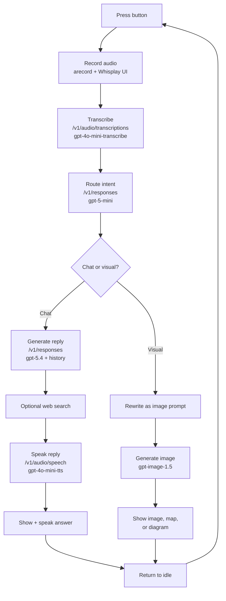

# Athena

Athena Whisplay voice assistant. This is now the Pi-target codebase: clone it onto the Raspberry Pi, add your `.env`, and run `main.py` or the included service.

Core device flow:

1. Press button to record audio
2. Transcribe with `gpt-4o-mini-transcribe`
3. Route the request with `gpt-5-mini`
4. Stream a reply from `gpt-5.4` when it is a chat turn
5. Let the model use OpenAI web search when needed
6. Speak the reply with `gpt-4o-mini-tts`
7. Show status and response text on the Whisplay display

## Workflow Diagram



### Scenario Notes

- Normal fact question:
  `STT -> intent router -> gpt-5.4 chat -> optional TTS -> screen`
- Current-events or weather question:
  `STT -> intent router -> gpt-5.4 chat + web search -> optional TTS -> screen`
- Visual request like image, map, or diagram:
  `STT -> intent router -> gpt-image-1.5 -> fullscreen display only`

Image mode:

- Explicit image requests such as “show me a picture of …” or “draw …” use `gpt-image-1.5`
- Athena shows the image full-screen and does not speak for that turn
- On the Pi, the next button press clears the image and returns to the normal voice flow

## Hardware

- Raspberry Pi Zero 2 W / WH
- PiSugar Whisplay HAT
- PiSugar battery board

## Pi Setup

### Prerequisites

- Raspberry Pi OS
- Python 3.11+
- Whisplay driver installed in a common path such as `/home/athena_pi/Whisplay/Driver/` or `/home/pi/Whisplay/Driver/`
- `alsa-utils` for `arecord` / `aplay`

### Install dependencies

On the Pi:

```bash
sudo apt install python3-numpy python3-pil python3-requests python3-dotenv alsa-utils ffmpeg
```

Then in the repo:

```bash
cp .env.example .env
./bootstrap.sh
```

`bootstrap.sh` creates a local virtual environment, but the real Pi service runs with system Python (`/usr/bin/python3`), so the system packages above should still be installed.

Then edit `.env`:

```bash
OPENAI_API_KEY="sk-..."
```

Optional image settings:

```bash
OPENAI_INTENT_MODEL="gpt-5-mini"
OPENAI_IMAGE_MODEL="gpt-image-1.5"
OPENAI_IMAGE_SIZE="1024x1024"
OPENAI_IMAGE_QUALITY="medium"
```

### Run on the Pi

```bash
sudo python3 /home/athena_pi/athena/main.py
```

### Run on boot with systemd

This repo includes `athena-whisplay.service`.

If the repo lives at `/home/athena_pi/athena`, install it with:

```bash
sudo cp athena-whisplay.service /etc/systemd/system/athena-whisplay.service
sudo systemctl daemon-reload
sudo systemctl enable athena-whisplay
sudo systemctl start athena-whisplay
sudo systemctl status athena-whisplay
sudo journalctl -u athena-whisplay -f
```

This service:

- waits for `network-online.target` and WM8960 audio readiness
- forces the full Whisplay speaker chain (`Speaker`, `Speaker AC`, `Speaker DC`, and `Playback`) to `100%` before startup
- reapplies that full speaker chain a few seconds after startup for reliability
- runs Athena with system Python as root
- restarts automatically if Athena exits unexpectedly

After it is enabled once, Athena should start automatically on every boot without SSH.

Useful service debug commands:

```bash
sudo systemctl status athena-whisplay
sudo journalctl -u athena-whisplay -b --no-pager
amixer -c 1 sget Speaker
```

Or use `sync.sh` from your laptop to deploy and restart it on the Pi.
