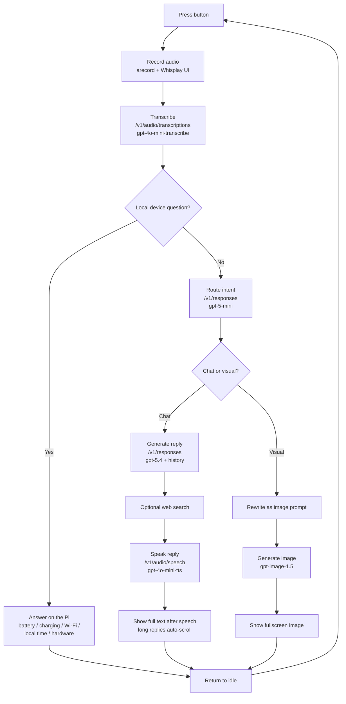

# Athena

Athena is a Raspberry Pi voice assistant built for the PiSugar Whisplay. This repo is the Pi-target codebase: clone it onto the Pi, add your `.env`, and run `main.py` manually or install the optional `systemd` service.

<p align="center">
  
</p>

## Current Device Flow

1. Press the hardware button to start recording.
2. Release the button to stop recording and transcribe with `gpt-4o-mini-transcribe`.
3. Before calling GPT, Athena checks whether the user asked about the device itself.
4. Device/self questions like battery, charging, Wi-Fi, online state, local time, and hardware identity are answered locally on the Pi.
5. Other requests go through the intent router with `gpt-5-mini`, plus deterministic fallbacks for explicit visual requests and follow-ups.
6. Chat replies stream from `gpt-5.4`, with optional OpenAI web search when enabled and useful.
7. Explicit image, map, diagram, and poster requests generate with `gpt-image-1.5`.
8. While Athena speaks, the owl animates on-screen with no speech bubble.
9. After speech finishes, Athena shows the full reply on a black text screen; long replies auto-scroll from top to bottom.

Interrupt behavior:

- Press the button while Athena is speaking to interrupt the current answer and immediately start a fresh listening turn.
- Quick accidental interrupt taps are ignored cleanly instead of surfacing tiny-WAV recorder errors.

Image mode:

- Explicit visual requests such as “show me a picture of …”, “give me a map of …”, or “generate a poster that says …” route to `gpt-image-1.5`.
- Athena shows the result full-screen and does not speak for that turn.
- The next button press clears the image and returns to the normal voice flow.

## Workflow Diagram



## Scenario Notes

- Device/self question:
  `STT -> local status handler -> on-device answer -> speak/show response`
- General chat question:
  `STT -> intent router -> gpt-5.4 chat -> TTS -> full response screen`
- Current-events or time-sensitive question:
  `STT -> intent router -> gpt-5.4 chat + optional web search -> TTS -> full response screen`
- Visual request like an image, map, diagram, or poster:
  `STT -> intent router -> gpt-image-1.5 -> fullscreen display only`
- Follow-up visual prompt like “show me a picture of him”:
  Athena uses recent conversation history to resolve the subject before image generation.

## Hardware

- Raspberry Pi Zero 2 W / WH
- PiSugar Whisplay HAT
- PiSugar battery board

## Pi Setup

### 1. Install the Whisplay driver

Athena expects the Whisplay Python driver in a common location such as:

- `/home/athena_pi/Whisplay/Driver/`
- `/home/pi/Whisplay/Driver/`
- `~/Whisplay/Driver/`

Fresh Pi setup:

```bash
cd ~
git clone https://github.com/PiSugar/Whisplay.git --depth 1
cd Whisplay/Driver
sudo bash install_wm8960_drive.sh
sudo reboot
```

Optional smoke test after reboot:

```bash
cd ~/Whisplay/example
sudo apt install -y python3-pil python3-numpy python3-pygame
sudo bash run_test.sh
```

### 2. Install Athena

```bash
cd ~
git clone https://github.com/yahya3867/athena.git
cd athena
sudo apt install -y python3-numpy python3-pil python3-requests python3-dotenv alsa-utils ffmpeg
cp .env.example .env
```

Then edit `.env` and at minimum set:

```bash
OPENAI_API_KEY="sk-..."
```

Recommended Pi audio settings:

```bash
AUDIO_DEVICE="plughw:1,0"
PLAYBACK_BIN="aplay"
```

Optional explicit WM8960 output override:

```bash
AUDIO_OUTPUT_DEVICE="plughw:1,0"
```

Notes:

- `.env.example` already defaults to `AUDIO_DEVICE="plughw:1,0"` and `PLAYBACK_BIN="aplay"`.
- `.env.example` leaves `AUDIO_OUTPUT_DEVICE="default"` unless you want to force the WM8960 card explicitly.
- Athena stores generated images under `output/images/`.

### 3. Optional PiSugar battery integration

Athena can show battery state without PiSugar if Linux exposes a battery device, but the intended handheld setup uses the PiSugar socket service.

If you want reliable on-screen battery and charging status on a fresh OS:

```bash
sudo raspi-config nonint do_i2c 0
sudo apt install -y netcat-openbsd wget
cd ~
wget -O pisugar-power-manager.sh https://cdn.pisugar.com/release/pisugar-power-manager.sh
bash pisugar-power-manager.sh -c release
sudo reboot
```

Choose `PiSugar 3` during install.

After reboot, verify:

```bash
ls /tmp/pisugar-server.sock
printf "get battery\n" | nc -q 0 -U /tmp/pisugar-server.sock
printf "get battery_charging\n" | nc -q 0 -U /tmp/pisugar-server.sock
sudo systemctl status pisugar-server
```

## Running Athena

### Manual Pi run

This is the simplest and most accurate way to run Athena during development:

```bash
cd ~/athena
sudo python3 /home/athena_pi/athena/main.py
```

Stop it with `Ctrl+C`.

### Optional systemd service

This repo includes `athena-whisplay.service`. If the repo lives at `/home/athena_pi/athena`, install it with:

```bash
cd ~/athena
sudo cp athena-whisplay.service /etc/systemd/system/athena-whisplay.service
sudo systemctl daemon-reload
sudo systemctl enable athena-whisplay
sudo systemctl start athena-whisplay
sudo systemctl status athena-whisplay
```

Useful service logs:

```bash
sudo journalctl -u athena-whisplay -b --no-pager
sudo journalctl -u athena-whisplay -f
```

The service:

- waits for `network-online.target`, `sound.target`, and `wm8960-soundcard.service`
- runs `/usr/bin/python3 /home/athena_pi/athena/main.py`
- sets `Speaker`, `Speaker AC`, `Speaker DC`, and `Playback` to `100%` before startup
- reapplies those mixer values a few seconds after startup for reliability
- restarts on failure

## Optional Dev Helpers

These scripts still exist, but they are helpers, not the primary Pi runtime path:

- `./bootstrap.sh`
  - creates `.venv`
  - installs `requirements.txt`
  - copies `.env.example` to `.env` if needed
- `./run_athena.sh`
  - runs `main.py` from the local virtual environment
- `python3 demo_runner.py check`
  - prints config and paths
- `python3 demo_runner.py prompt-check`
  - runs the prompt-routing regression suite
- `./sync.sh`
  - deploys to a Pi over SSH, builds a `.venv`, and reinstalls/restarts the `systemd` service
  - use this only if you want the service-based deployment flow

For quick local dev with the helper environment:

```bash
./bootstrap.sh
source .venv/bin/activate
python3 demo_runner.py check
python3 demo_runner.py prompt-check
```

## Contributors

- **Yahya Masri**
- **Tuga Wangjie**
- **Hamza Essaifi**
